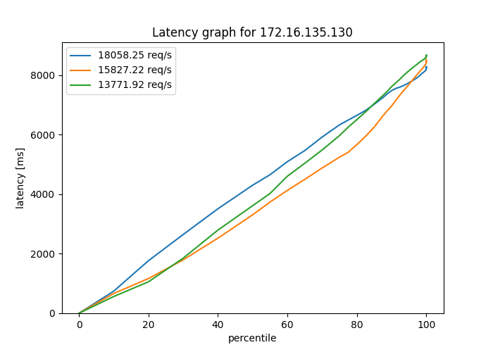
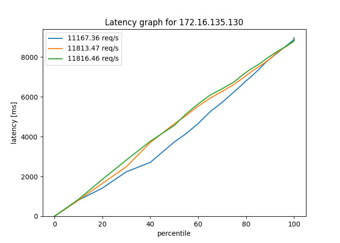
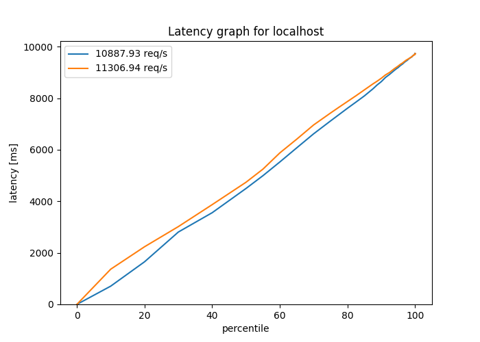
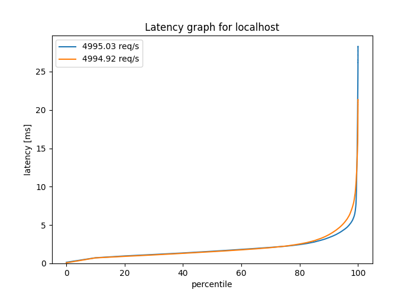
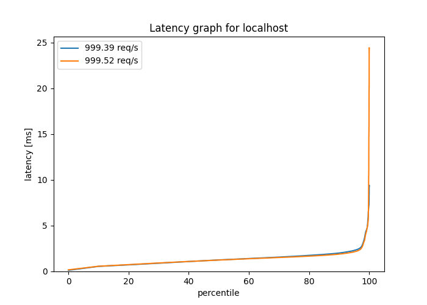
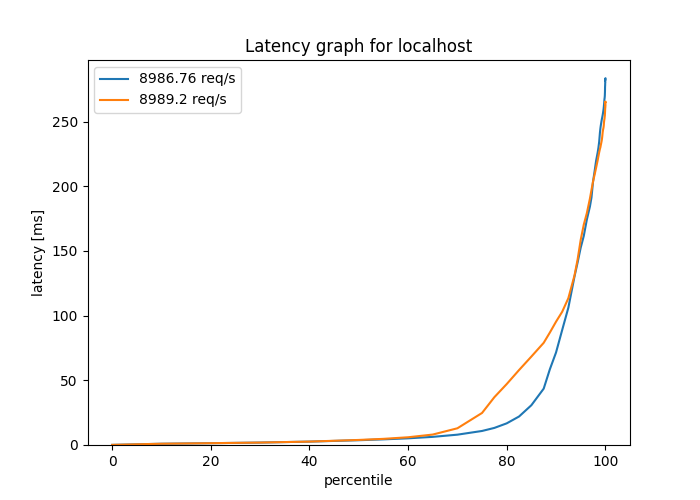
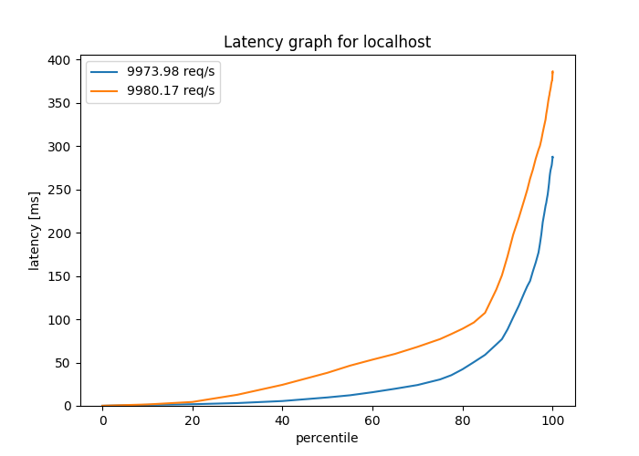

# Micro-Quanta Scheduler

Micro-Quanta is a linux scheduler for latency sensitive tasks available as a patch for kernel v5.3.

This repository holds my experimets comapring MQ and CFS.

Memcache perf is used for memcached evaluation.

## 1. Memcached tests

Command:

`$ mcperf -s localhost --scan=10:1000000:100000 -t 1 -c 8 -T 24`

### 1.1 MQ

    MQ config:
        - runtime: 40000 ns
        - period: 50000 ns

[Result](./test1.txt)

### 1.2 MQ
    MQ config:
        - runtime: 20000 ns
        - period: 40000 ns

[Result](./test2.txt)

### 1.3 CFS 

Default ubuntu config.

[Result](./test3.txt)

## 2. HTTP echo server tests

## 2.1 Isolated

Isonaled HTTP server running on docker. The echo server was the only application running.
HTTP echo server: hashicorp/http-echo 

### 2.1.1 MQ

    MQ config:
        - runtime: 20000 ns
        - period: 40000 ns

[Result](./http-echo/normal-p4r2)

### 2.1.2 MQ

    MQ config:
        - runtime: 40000 ns
        - period: 50000 ns

[Result](./http-echo/normal-p5r2)

### 2.1.3 CFS

Default config.

[Result](./http-echo/normal-cfs)

### 2.1.4 
Blue: MQ with period: 40us & runtime: 20us

Green: CFS

Orange: MQ with period: 50us & runtime: 40us

## 2.2 Colocation

`stress-ng` was running in the backroug as antigonistic app. 
No affinity was set.

### 2.2.1 MQ

    MQ config:
        - runtime: 20000 ns
        - period: 40000 ns

[Result](./http-echo/stress-p4r2)

### 2.2.2 MQ

    MQ config:
        - runtime: 40000 ns
        - period: 50000 ns

[Result](./http-echo/stress-p5r2)

### 2.2.3 CFS

Default config.

[Result](./http-echo/normal-cfs)

### 2.2.4 
Blue: MQ with period: 40us & runtime: 20us
Green: CFS
Orange: MQ with period: 50us & runtime: 40us

> With having the stress running the throughput of my VM is ~10000 RPS

## 2.3 Collocation with affinity

Http server assigned to cores 0 and 1.

`Stress-ng` is asssigned to core 0.

`wrk2` is assigned to cores 2 and 3.

### 2.3.1
RPS: 400000
> Not all requests are resolved

[blue: period: 50000ns & runtime: 40000ns](./stress/2)

[orange: period: 40000ns & runtime: 20000ns](./stress/1)

### 2.3.2

RPS: 5000

> This RPS is almost half the throughput of my VM with its current config

[blue: period: 50000ns & runtime: 40000ns](./stress/4)

[orange: period: 40000ns & runtime: 20000ns](./stress/3)

### 2.3.3

RPS: 1000

> There is a spike in period: 40000 & runtime: 20000 on 99.9th percentile latency

[blue: period: 50000ns & runtime: 40000ns](./stress/6)

[orange: period: 40000ns & runtime: 20000ns](./stress/5)

### 2.3.4

RPS: 9000

[blue: period: 50000ns & runtime: 40000ns](./stress/8)

[orange: period: 40000ns & runtime: 20000ns](./stress/7)

### 2.3.5

RPS: 10000

> Almost a the max throughput of my VM

[blue: period: 50000ns & runtime: 40000ns](./stress/10)

[orange: period: 40000ns & runtime: 20000ns](./stress/9)

